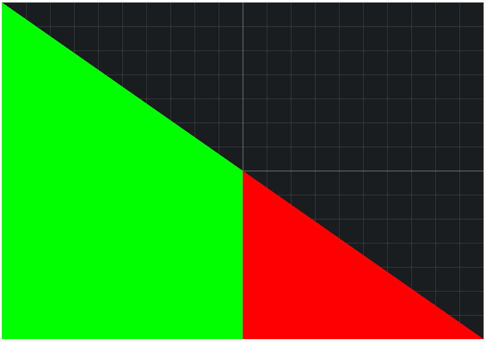
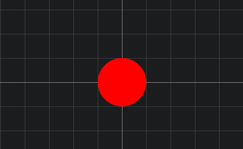

## Shader编程教程

shader也称`着色器`.着色器分为`顶点着色器`和`片元着色器`.顶点着色器负责位置的计算，片元着色器负责颜色的计算。


## 第一个程序

为了方便观察距离效果，我使用了CSS添加了网格线。

```html
<div class="grid">
	<canvas id="app" width="1000" height="700"></canvas>
	<div class="xaxis"></div>
	<div class="yaxis"></div>
</div>
```
```js
const el = document.getElementById("app")
const gl = el.getContext("webgl")
// 创建顶点着色器
var vertexShader = gl.createShader(gl.VERTEX_SHADER);
gl.shaderSource(vertexShader, `
    precision mediump float;
    attribute vec2 a_Position;
    void main(){
        gl_Position = vec4(a_Position,0.0, 1.0);
    }
`);
gl.compileShader(vertexShader);

// 创建片元着色器
var fragmentShader = gl.createShader(gl.FRAGMENT_SHADER);
gl.shaderSource(fragmentShader, `
    precision mediump float;      
    void main(){
        if(gl_FragCoord.x>500.0){
            gl_FragColor = vec4(1.0,0.0,0.0,1.0);
        }else{
            gl_FragColor = vec4(0.0,1.0,0.0,1.0);
        }
        
    }
`);
gl.compileShader(fragmentShader);
// 创建程序
var program = gl.createProgram();
//将顶点着色器挂载在着色器程序上。
gl.attachShader(program, vertexShader); 
//将片元着色器挂载在着色器程序上。
gl.attachShader(program, fragmentShader);
//链接着色器程序
gl.linkProgram(program);
gl.useProgram(program);

const buffer = gl.createBuffer()
// 通过类型化数组来传递数据给webgl
const data = new Float32Array([
    -1.0,1.0,
    -1.0,-1.0,
    1.0,-1.0,
])
gl.bindBuffer(gl.ARRAY_BUFFER,buffer)
gl.bufferData(gl.ARRAY_BUFFER,data,gl.STATIC_DRAW)
const a_position_pointer = gl.getAttribLocation(program,'a_Position')
gl.vertexAttribPointer(a_position_pointer,2,gl.FLOAT,false,8,0)
gl.enableVertexAttribArray(a_position_pointer)
// 绘制三角形
gl.drawArrays(gl.TRIANGLES,0,3)
```
效果如图所示：



## 基础语法
程序开始执行的入口

## 变量

## 宏

## 常用函数

## length
`length` 函数通常用于计算向量的长度（也称为模）
```js
vec3 v = vec3(3.0, 4.0, 0.0); // 一个三维向量
float len = length(v); // 计算向量长度
```

## distance
distance 函数用于计算两个点之间的距离。
```
vec2 point1 = vec2(1.0, 2.0);
vec2 point2 = vec2(4.0, 6.0);
float dist = distance(point1, point2);
```
distance 函数的计算开销相对较高，因为它涉及平方根的计算。如果只需要比较距离大小而不需要实际的距离值，可以考虑使用距离的平方，以避免开销


## step
step(x, y)是阶梯函数，当y小于x时值为0，y大于等于x时值为1,例如我们绘制


## dot

## mix

## 


## 常见效果

## 圆形的绘制

## 渐变圆形

## 三角函数

## 矩形

## 椭圆形

## 三角形

## 画一个爱心

## step 
step 函数传入两个参数，step(x,y),当 y>=x 时，返回1.0，否则返回 0.0，注意返回值类型为浮点数。  
下面使用step函数画一个半径为 50 的圆。
```c
vec2 p = (gl_FragCoord.xy - vec2(500.0,350.0)) / 50.0;
float distanceSquared = dot(p, p);
if(step(distanceSquared,1.0) == 1.0){
    gl_FragColor = vec4(1.0, 0.0, 0.0, 1.0); // 红色
}else{
    discard;
}
```


如果没有step函数，也可以使用`比较`来实现
```c
if(distanceSquared<1.0){
    gl_FragColor = vec4(1.0, 0.0, 0.0, 1.0); // 红色
}else{
    discard;
}
```

## smoothstep


